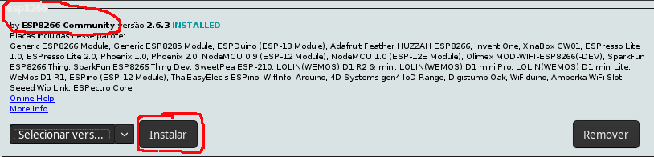

# Começando 

Para começar vamos começar com um programa para testar se tá tudo ok com o processo de compilação, de usar a IDE do arduino, e começar a se familiarizar com os pinos. [essa nao é a versão definitiva.. ainda falta melhorar kk]

## Configurando a IDE do Arduino para programar o NodeMCU 

### 1. Colocando o URL adicional para Gerenciador de Placas

Para fazer isso, na IDE do Arduino, clique em:

```Arquivo -> Preferências```

E cole o seguinte link no lugar a seguir

```http://arduino.esp8266.com/stable/package_esp8266com_index.json```


Assim a sua IDE estará com a extensão do ESP8266!

### 2. Instalando o suporte a placa esp8266

```Ferramentas -> Placa -> Gerenciador de Placas``` 

Instale a placa _**esp8266 by ESP8266 Community**_



Após isso, em ```Ferramentas -> Placa``` selecione _**Generic ESP8266 Module**_

Pronto, sua IDE está preparada para programar um ESP!

## Compilando o circuito Blinking

Para testar se está tudo OK, nananam nananam.. bla bla bla..

### Monte o circuito como mostra abaixo:


Explicação genérica do circuito aqui... bla bla bla falar que a pinagem pode ser diferente, mostrar exemplo

FALAR PINAGEM SOBRE GPIO e DX pra consultar tabela


### Hora do código!

Use o código que está em [code](code) ou copie o código abaixo:

```
print('code example')
print('code example')
print('code example')
print('code example')
```

Tente carregar e nananam...

Se você fez tudo certo a LED vai acender e apagar a cada segundo, isto significa que você configurou certo e ta tudo funcionando e está pronto para aprender mais coisa.


