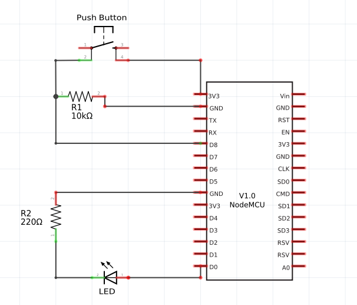
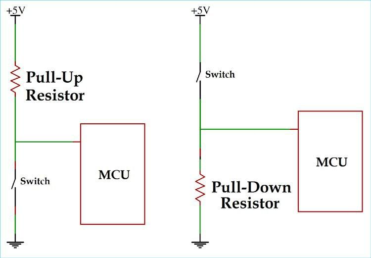

# 2. Ler estado de um botão e exibir no computador via serial

Esse projeto consiste no controle de um LED (liga/desliga) através de um botão, exibindo no "monitor serial" a informação digital do botão (HIGH/LOW).

O circuito também conhecido como "escrita digital/leitura digital" pode ser empregado de formas distintas na vida cotidiana. Habilitar ou desabilitar uma saída, apesar de simples, é uma prática fundamental e bem comum. Ao invés de se utilizar um LED, podemos utilizar esse circuito como base e, por exemplo, acionar uma sirene que nos informa, através de efeito sonoro, o vazamento de um produto venenoso em uma indústria de produtos químicos.

> Nesse projeto você irá aprender a transmitir as informações entre diferentes circuitos através da programação e utilizar os botões (push button) utilizando a técnica Pull-down.

## Conteúdo
- [Materiais Necessários](#materiais-necessários)
- [Montagem do Circuito](#montagem-do-circuito)
- [Código do Circuito](#o-c&oacute;digo-do-circuito)

## Materiais Necessários
1. NodeMCU
2. 1 LED
3. 1 PushButton
4. 2 Resistores (um de 220Ω e outro na ordem de 10kΩ) 
6. Protoboard
7. Jumpers

## Montagem do Circuito




O circuito deve ser montado como mostra a figura acima, representado de maneira esquemática e em protoboard. Ele dividido em duas partes, uma do LED e a outra do push button.

É necessário conectar um terminal do LED em uma porta digital do NODEMCU, pois através dessa conexão, é possível controlar o envio de 5V ou 0V para o LED (ligando/desligando). O outro terminal, deve ser conectado a um resistor limitador de corrente com valor de resistência em torno de 220Ω e, em seguida, ir direto para o GND.

A outra etapa de montagem do circuito é a conexão do PushButton. Nesse sentido, é necessário entender um pouco sobre Pull-Up e Pull-Down.



O circuito Pull-UP garante que antes de apertar o botão, a entrada digital do NODEMCU apresente 5V (o NODEMCU possui alta impedância e o circuito se comporta como um aberto, assim impedindo a passagem de corrente, não havendo, então, queda no Resistor de Pull-Up). O circuito Pull-Down, por sua vez, garante 5V somente após e enquanto o botão for pressionado. Desse modo, essa parte do circuito visualizado na figura "Schematic", é implementado a partir do circuito Pull-Down. 

É importante que o resistor de pull up ou pull down seja de um valor alto de resistencia para não solicitar muita corrente do µC, nesta montagem utilizamos um de 10kΩ.

Na imagem e no circuito em específico, o terminal "MCU" é uma entrada digital do NODEMCU.


## O código do Circuito

Use o código que está em [code](code) ou copie o código abaixo:
 
```C++
const int pushButton = D8;
const int led        = D0;

void setup() {
  Serial.begin(115200);
  pinMode(pushButton, INPUT);
  pinMode(led, OUTPUT);
}

void loop() {
  int buttonState = digitalRead(pushButton);
  Serial.println(buttonState);
  digitalWrite(led,buttonState);
  delay(1);
}
```
O código acima começa com a declaração e associação da entrada e saída utilizada. O botão foi associado à constante 15 do NODEMCU e o LED à constante 16. Feito isso, partimos para o void setup onde é necessário iniciar a comunicação serial através do comando ```Serial.begin``` definindo a taxa de transmissão de dados e declarar as entradas e saídas por meio do pinMode.

Após isso, dentro do void loop, declaramos uma variável "buttonState", que lê o valor digital da entrada do PushButton utilizando a função digitalRead. Essa variável será utilizada em dois momentos: 

1) ao utilizarmos a função ```Serial.println``` para exibir os valores que essa variável assume no monitor serial
2) controlar o LED a partir do digitalWrite e com os níveis UP/DOWN da variável

Você deve ter percebido o uso de ```delay(1)```, certo? Nesse caso, o uso da função delay implica criar um debouncing via software, isto é, a partir de um espaço de tempo (delay), conseguimos fazer com que a mudança de estado do botão seja visualizado de forma satisfatória.

Após upar o código para a placa, ele deve funcionar como no gif abaixo, para ver o estado do ```buttonState``` na IDE no Arduino vá em ```Ferramentas > Monitor serial``` ou pressione ```Ctrl + Alt + M```.

Caso tenha tido algum problema abra uma issue clicando [aqui](https://github.com/PETEletricaUFBA/IoT/issues/new) 


> Tente colocar mais leds e botões usando mais portas!
