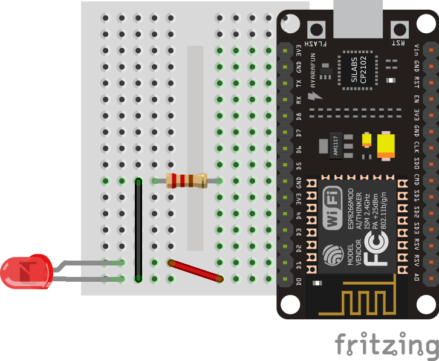

# Primeiros passos

Esta aplicação nos permite ligar e desligar a luz do LED periodicamente, ela é conhecida também como "Pisca-LED" ou "Blinking". Apesar de extremamente simples, aplicações como essas nos permite criar conhecimentos e estratégias interessantes para acionamentos de outros dispositivos como lâmpadas, motores ou qualquer elemento que represente uma saída no seu circuito. 

> Neste exemplo você vai aprender a adicionar a extensão do ESP8266 à IDE do Arduino e a carregar seu primeiro código!

## Conteúdo
- [Materiais Necessários](#materiais-necessários)
- [Configurando a IDE do Arduino para programar o NodeMCU](#configurando-a-ide-do-Arduino-para-programar-o-nodemcu)
  - [Colocando o URL adicional para Gerenciador de Placas](#colocando-o-url-adicional-para-gerenciador-de-placas)
  - [Instalando o suporte para a placa ESP8266](#instalando-o-suporte-para-a-placa-esp8266)
- [Compilando o circuito Blinking](#compilando-o-circuito-blinking)
  - [Montagem do circuito](#montagem-do-circuito)
  - [Hora do Código!](#hora-do-c&oacute;digo)
  - [Compile e Execute](#compile-e-execute)


## Materiais Necessários
1. NodeMCU
2. 1 Resistor 220Ω
3. 1 LED (de qualquer cor)
4. 1 Protoboard
5. 2 Jumpers

## Configurando a IDE do Arduino para programar o NodeMCU 

### Colocando o URL adicional para Gerenciador de Placas

Para fazer isso, na IDE do Arduino, clique em:

```Arquivo -> Preferências```

E cole o seguinte link no local indicado na imagem abaixo.

```http://arduino.esp8266.com/stable/package_esp8266com_index.json```


Assim a sua IDE estará com a extensão do ESP8266!

### Instalando o suporte para a placa ESP8266

```Ferramentas -> Placa -> Gerenciador de Placas``` 

Instale a placa _**esp8266 by ESP8266 Community**_


Após isso, em ```Ferramentas -> Placa``` selecione _**NodeMCU 0.9**_ ou _**NodeMCU 1.0**_

Pronto, sua IDE está preparada para programar um ESP!

## Compilando o circuito Blinking

O circuito permite trabalhar com:

- [x] Escrita Digital

### Montagem do circuito:

Monte o circuito como mostra abaixo:



**Note que o resistor será responsável por limitar a corrente que circula no circuito, evitando que ultrapasse a corrente nominal de operação do LED e o queime.**

Além de resistor e LED, é preciso que se conheça a pinagem do NODEMCU8266 e é importante salientar que a posição dos pinos modificam conforme a versão e modelo do NODEMCU8266 que o usuário possua. No entanto, para a nossa felicidade, apesar de se encontrar em posições diferentes, a aplicabilidade dos pinos é universal, ou seja, ao encontrarmos o General Purpose Input/Output 16 (GPIO16) em um NODEMCU8266 v1.1 e identificarmos o GPIO16 em uma outra posição em um outro NODEMCU8266, este pino apresentará as mesmas especificações e aplicabilidades no kit de desenvolvimento anterior.

#### Pinagem do Kit de Desenvolvimento

Abaixo é possível visualizar a identificação dos pinos da placa:


| Pino | Descrição |
| -------- | -------- |
| VIN  | Pino de alimentação externa (recomenda-se 5,0V / 1A). Não use-o se estiver usando a USB.     |
| GND  | Esse é o terra da placa. Não se esqueça de conectá-lo ao terra de outros dispositivos.   |
| RST     | Reset do módulo ESP-12. Nível LOW(0V) dá um reboot na placa.    | 
| EN    | (Enable) ativa o módulo ESP-12 quando o nível for HIGH(3,3V).     | 
| 3.3V     | 3.3V – saída do regulador interno 3,3V – Para alimentar outro dispositivo, não use mais do que 500 mA de corrente. | 
| SD0 | interface SPI (master in serial out) – pino MISO (GPIO_7) |
| CMD | interface SPI (chip select) – pino CS (GPIO_11) |
| SD1 |  interface SPI (master out serial in) – pino MOSI (GPIO_8) |
| SD2 | pino GPIO_9 pode ser usado também para comunicação com SD Card (SDD2) |
| SD3 | pino GIPO_10 – pode ser usado também para comunicação com SD Card (SDD3) |
| ADC0 | pino de entrada do conversor analógico digital ADC de 10 bits. Tensão máxima de 1,1V (variação do valor digital – 0 a 1024).|
|D0 | pino GIPO_16 pode ser usado para acordar (WAKE UP) o ESP8266 em modo sono profundo (Deep sleep mode).|
| D1 | pino GPIO_5 – entrada ou saída.|
|   D2 | pino GIPO_4 – entrada ou saída.|
|  D3 | pino GPIO_0 é usado também para controlar o upload do programa na memória Flash. Esta conectado no botão FLASH.|
| D4 | pino GPIO_2 – UART_TXD1 quando carregando o programa na memória FLASH|
|D5 | pino GPIO_14  pode ser usado em SPI de alta velocidade (HSPI-SCLK)|
| D6 | pino GPIO_12  pode ser usado em SPI de alta velocidade (HSPI-MISO)|
| D7 | pino GPIO_13  pode ser usado em SPI de alta velocidade (HSPI-MOSI) ou UART0_CTS.|
| D8 | pino GPIO_15  pode ser usado em SPI de alta velocidade (HSPI-CS) ou UART0_RTS.|
| RX |pino GPIO_3 – U0RXD quando carregando o programa na memória FLASH.|
| TX | pino GIPO_1 – U0TXD quando carregando o programa na memória FLASH.|

### Hora do código!

Use o código que está em [code](code) ou copie o código abaixo:

```C++
const int led=16;

void setup() {
  pinMode(led, OUTPUT);
}

void loop() {
  digitalWrite(led, HIGH);
  delay(1000);
  digitalWrite(led, LOW);
  delay(1000);                 
}
```
É importante entender que no código acima utilizamos a correlação entre as entradas/saídas e as constantes pré-definidas:


Como se pode observar pela tabela, o LED foi conectado no terminal D0 que tem como constante o valor igual a 16.

### Compile e Execute

Para compilar o código e verificar erros clique no primeiro botão abaixo, caso queira dar um upload para a placa, clique no segundo botão.


Se você fez tudo certo, o LED vai acender e apagar a cada segundo (função delay). Isso significa que você configurou certo, está tudo funcionando e pronto para desenvolver novas ideias.

Caso tenha tido algum problema abra uma issue clicando [aqui](https://github.com/PETEletricaUFBA/IoT/issues/new) 

#### Exemplo da montagem


> Experimente variar a frequência com que o LED pisca

