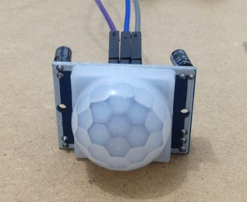
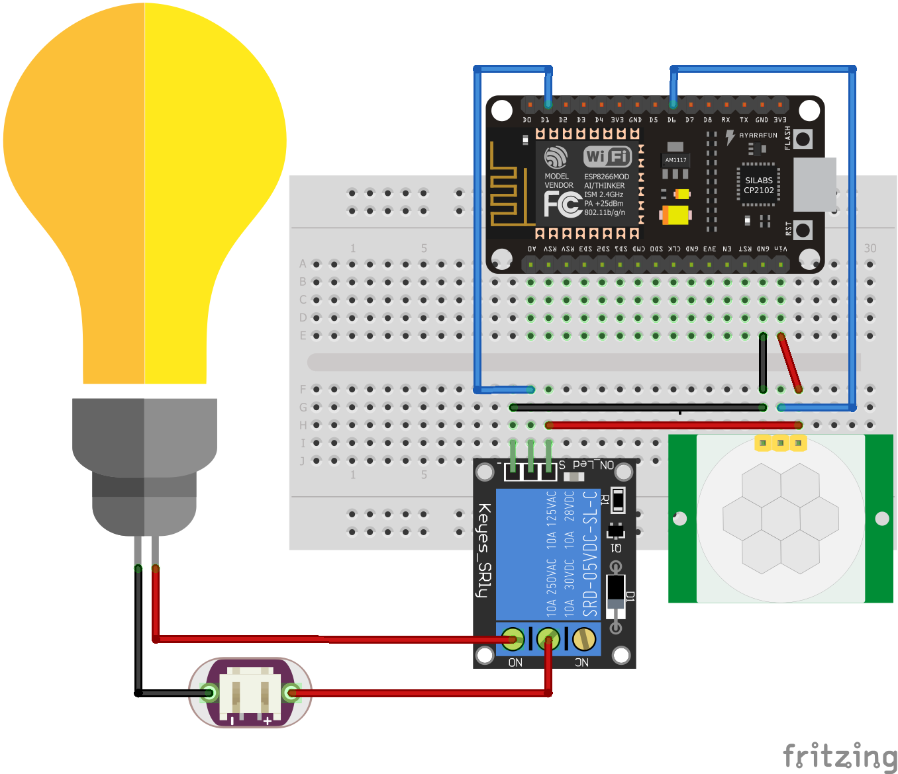

# 1. Relé controlado por sensor
Esse projeto dá início à parte de atuadores do Módulo 2. Utilizaremos diversos circuitos e, por meio desses, aprenderemos o que são e como funcionam alguns importantes e usuais atuadores.

Antes de explicar o primeiro circuito, é de extrema importância compreender em que consistem os atuadores. Eles são dispositivos ou equipamentos que convertem energia (elétrica, hidráulica ou pneumática) em movimento (energia mecânica). Além disso, são amplamente utilizados na Indústria ou em processos de fabricação. Alguns exemplos de atuadoressão os relés, as válvulas, as bombas e os motores hidráulicos e elétricos. 

Um dos atuadores mais comuns em nossas vidas são os nossos músculos. Eles recebem as calorias (forma de energia) que consumimos dos alimentos. Essa energia pode ser usada pelos músculos – que agem como atuadores – para criar movimentos, como andar, acenar, subir uma escada ou correr para pegar o ônibus.

O primeiro projeto que iremos desenvolver consiste em um relé que será controlado por um sensor. Criaremos uma aplicação que é muito comum em lobbies de prédios, corredores de residências e em escadas prediais e para conceber essa aplicação, utilizaremos um sensor de movimento para detectar a presença de invíduos e, quando a presença for detectada, o relé atuará permeando o acendimento de uma lâmpada.

[Como já vimos](https://github.com/PETEletricaUFBA/automacao-iot-nodemcu/tree/master/M%C3%B3dulo%202/Sensores/1.%20Sensor%20de%20presen%C3%A7a%20PIR), o sensor de movimento ou PIR é um componente eletrônico capaz de detectar a variação de luz infravermelha emitida pelo corpo humano. Em outras palavras esse dispositivo detecta movimentos de objetos que exalam calor e que estejam dentro do seu raio de detecção que alcança até 7 metros. O PIR é muito utilizado em diversas aplicações, seja para segurança, economia de energia, entre outros. 



Nesse momento você pode estar se perguntando o que é ou como funciona um relé. Assim como já descrito, o relé é caracterizado como um atuador, transformando energia elétrica em energia mecânica (movimento). É um dispostivo eletromecânico, uma vez que a passagem da corrente elétrica gera um campo eletromagnético capaz de movimentar os seus contatos, permitindo abrir ou fechar circuitos (no caso, ligar ou desligar uma lâmpada).


O circuito de um relé acionado por um sensor de movimento possibilita o aprendizado da seguinte competência trabalhada no Módulo 1:

- [x] Leitura Digital
- [x] Escrita Digital

## Conteúdo
- [Materiais Necessários](#materiais-necessários)
- [Montagem do Circuito](#montagem-do-circuito)
- [O Código do Circuito](#o-c&oacute;digo-do-circuito)

## Materiais Necessários
1. NodeMCU
2. 1 Sensor de Movimento
3. Módulo relé
4. Protoboard
5. Jumpers
6. Lâmpada fluorescente, LED ou incandescente

## Montagem do Circuito
O circuito deve ser montado como mostra a figura abaixo, representado na protoboard. 



Como visualizado na imagem acima, o sensor de presença apresenta seis terminais distintos (3 pinos e 3 "parafusos"). Dos pinos, um deles será conectado em uma porta digital do NODEMCU, enquanto as outras duas deverão ser conectadas no VCC e GND. 

Os outros 3 terminais da outra extremidade que se conectam com a saída (neste caso a saída representa o circuito contendo a lâmpada) apresentam especificidades que precisam ser explicadas: Os relés possuem dois tipos diferentes de contatos elétricos – normalmente aberto – NA (NO – Normally Open) e normalmente fechado – NF (NC – Normally Closed).

A tensão de alimentação de 120-240V, que acionará a lâmpada, está estabelecida no relé pelo terminal comum (terminal central) independentemente da configuração preterida. Para usar os contatos normalmente abertos, usamos o terminal NO – assim, a lâmpada permanecerá apagada enquanto o sensor não ativar o circuito. Para usar os contatos normalmente fechados, usamos o terminal NC – neste caso, a lâmpada permaneceria acesa até o circuito ser ativado pelo sensor.

A escolha dos contatos depende de como queremos que o interruptor seja empregado. Neste projeto queremos que a lâmpada seja acesa com o acionamento do relé, portanto queremos ligá-la, e por isso usaremos os contatos NO (NA) do relé

## O código do Circuito

Use o código que está em [code](code/code1.ino) ou copie o código abaixo:
 
```C++
#define sensor D6
#define rele  D1

void setup() {
  pinMode(rele, OUTPUT);
  pinMode(sensor,INPUT);
}

void loop() {
  int pir = digitalRead(sensor);
  if (pir == HIGH) {
    digitalWrite(rele,HIGH);
    delay(5000);
}
else{
    digitalWrite(rele,LOW);
    delay(5000);
  }
}
  
```
O código acima começa com a declaração e associação das saídas e entradas utilizadas. O PIR foi associado à constante 12 (D6) e o PIR à constante 5 (D1). Feito isso, partimos para o void setup onde é necessário declarar as entradas e saídas por meio do pinMode.

Posteriormente, no void loop iniciamos com a declaração de uma variável e o uso da função digitalRead que obterá informação digital através da leitura da variável sensor. A informação será armazenada na variável pir

Além disso, utiliza-se uma estrutura condicional if, de modo que se a variável pir estiver com um nível lógico 1, então o relé atua ligando a lâmpada, e com o nível lógico 0, a lâmpada se encontra desligada. Você deve ter percebido o uso da função digitalWrite que tem a seguinte sintaxe: digitalWrite(pin,value). O pin é justamente a entrada ou saída declarada no void setup, enquanto que value é um parâmetro que varia entre ligado e desligado(HIGH/LOW).


> Pense em outras aplicações do módulo relé em seu cotidiano. 

