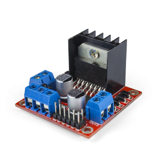
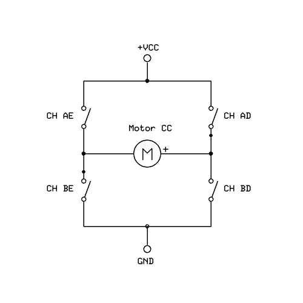
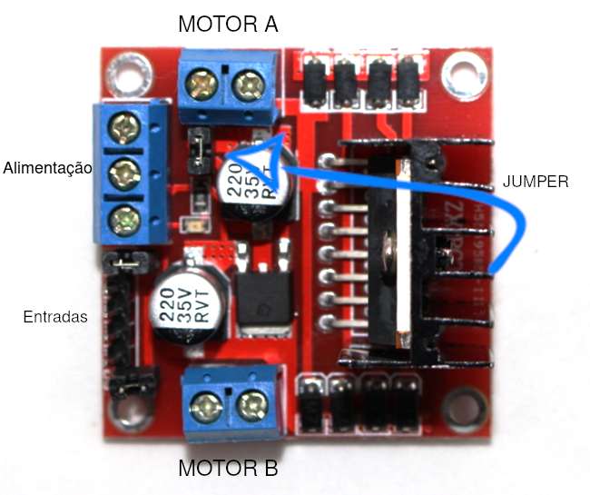

# 4. Motor usando Ponte H e controle através de potenciômetro

Por meio desse módulo aprenderemos o que são e como funcionam alguns importantes e usuais atuadores. Dessa vez, aprenderemos um pouco mais sobre o circuito ponte H e motores;

O quarto projeto que desenvolveremos consiste na utilização de um motor usando ponte H controlado através de potenciômetro. Por meio desse desse circuito concebemos uma montagem capaz de controlar motores em geral, extremamente utilizada em robôs seguidores de linha, por exemplo.



Nesse momento você pode estar se perguntando o que é ou como funciona uma ponte H. A ponte H é um circuito eletrônico que possibilita uma série de facilidades, entre elas, permitir que o motor ligue e desligue, altere o sentido e a velocidade de rotação.

O circuito eletrônico que representa a ponte H pode ser visualizado na imagem abaixo:



Quando queremos que o motor gire para um lado, basta acionar as chaves CH AD e CH BE. Caso queiramos que o motor gire para o lado inverso, abre-se as chaves anteriores e fecha-se as chaves CH AE e CH BD.

Percebe-se que por meio da comutação de chaves pode-se fazer o motor assumir dois estados de rotação (horário e anti-horário). Diferentemente do que a foto induz, o acionamento das chaves ocorre de forma eletrônica por meio de um chip embarcado.

O circuito do chip LM298N é um pouco diferente do mostrado anteriormente, mas o funcionamento similar. Além disso é possível outros dois estados de funcionamento além de horário e anti-horário como o ponto morto e o freio como veremos a seguir.

> Neste projeto você irá aprender como realizar o controle de um motor DC com 4 tipos de estados de operação utilizando a ponte H.

## Conteúdo

- [Materiais Necessários](#materiais-necessários)
- [Montagem do Circuito](#montagem-do-circuito)
- [O Código do Circuito](#o-c&oacute;digo-do-circuito)

## Materiais Necessários

1. NodeMCU
2. Ponte H L298N
3. Potenciômetro
4. Protoboard
5. Jumpers

## Montagem do Circuito

Primeiramente vamos conhecer os terminais da Ponte H:



Como visualizado na imagem acima, a ponte H possui conjuntos de terminais:

### Motores

- `OUT1`: Pino de saída para o motor A;
- `OUT2`: Pino de saída para o motor A;
- `OUT3`: Pino de saída para o motor B;
- `OUT4`: Pino de saída para o motor B;

### Alimentação

- `+12V`: Tensão de alimentação dos motores. (Recomendado 12V, para outras tensões, consultar _data sheet_);
- `GND`: Pino de referência;
- `+5V`: Tensão de alimentação para circuitos lógicos do chip;

### Entradas

- `ENA`: Pino de enable para o motor A;
- `IN1`: Pino de entrada para o motor A;
- `IN2`: Pino de entrada para o motor A;
- `IN3`: Pino de entrada para o motor B;
- `IN4`: Pino de entrada para o motor B;
- `ENB`: Pino de enable para o motor B;

A tabela a seguir relaciona as entradas com o movimento do motor A:

| Motor A      | IN1      | IN2      |
| ------------ | -------- | -------- |
| Horário      | VCC      | GND      |
| Anti-horário | GND      | VCC      |
| Ponto morto  | GND      | GND      |
| Freio        | VCC      | VCC      |

O motor B funciona analogamente como o motor A com as entradas IN3 e IN4.

O circuito deve ser montado como mostra a figura abaixo, representado na protoboard. Note que iremos apenas utilizar um motor neste exemplo, porém é possível utilizar dois motores simultaneamente.

<!-- FAZER NO FRITZING -->


Além disso, a ponte H apresenta uma particularidade em sua montagem: é preciso definir de que forma prefere alimentar o circuito, isto é, alimentará  o circuito com o módulo ESP8266 ou por meio de uma fonte de energia externa? A depender da sua resposta, algumas alterações no circuito devem ser efetuadas.

Ao utilizar uma alimentação externa para o motor, é necessário que o jumper do regulador de tensão esteja conectado.

## O código do Circuito

Use o código que está em [code](code/code.ino) ou copie o código abaixo:

```C++
void setup() {
 
}

void loop() {
 
}
  
```

<!-- Explicação Código -->


> Pense na quantidade de aplicações que podemos fazer com este chip, como por exemplo, um robô!
