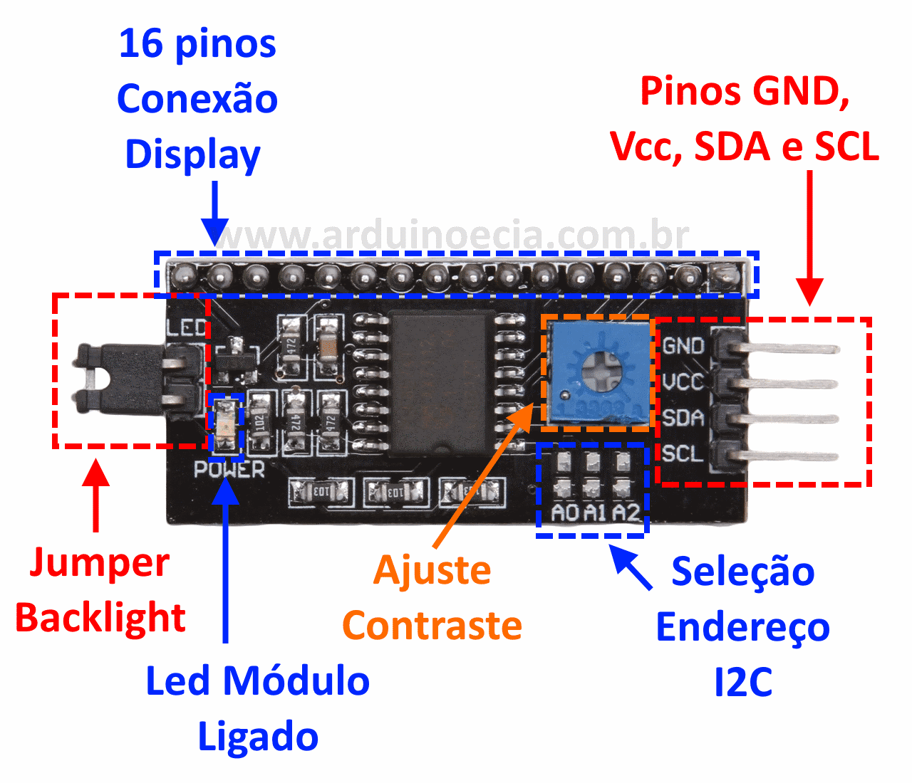

# 5. Escrita em um display LCD com o protocolo I2C

O projeto consiste em realizar o processo de escrita em um display LCD 20x4 com o auxílio do módulo I2C. Este módulo permite utilizar o display LCD 16x2 ou 20x4 com o uso de apenas dois pinos do NodeMCU: o pino analógico D2 (Serial Data - SDA) e o pino analógico D1 (Serial Clock - SCL). Módulos de display LCD de caracteres alfanuméricos são interfaces de comunicação visual que se encontram em quase todos os eletrônicos. São caracterizados por sua capacidade gráfica (número de caracteres por linha x número de linhas), por exemplo, 16x2 ou 20x4. Mas afinal, o que é o protocolo I2C?


Inventado pela Philips no início da década de 90, o I2C é um protocolo de barramento que conecta todos os dispositivos do setup com os mesmos dois fios (SDA e SCL), reduzindo o números de pinos utilizados do NodeMCU. O I2C é implementado no display através de um circuito chamado de I2C bus, que interpreta os sinais recebidos e envia adequadamente sinais de retorno, permitindo essa comunicação. Perceba que o ESP não necessita de um bus, visto que possui suporte a esse protocolo.



Além das conexões que relacionam o NodeMCU ao display, possui ainda um potenciômetro para ajustar o contraste do display e o Jumper Backlight, que pode ser usado para controlar a luz de fundo. Sua peculiaridade é a comunicação serial de um controlador com um grande número de dispositivos (que varia de 1 a mais de 100, normalmente), e no nosso caso isso se configura como uma vantagem pelo fato de, apesar de o display possuir 16 portas, o que ocuparia a maioria das portas do NodeMCU, fazendo uso do protocolo I2C é possível conectá-lo usando apenas duas. Ao NodeMCU damos o nome de "master", o dispositivo que manda sinais de leitura e escrita, e aos demais periféricos conectados que recebem os sinais (no nosso caso, apenas o display LCD), damos o nome de "slave".


O circuito e código para a escrita em display LCD com o protocolo I2C possibilita o aprendizado das seguintes competência trabalhadas no Módulo 1:

- [x] Escrita Analógica

## Conteúdo
- [Materiais Necessários](#materiais-necessários)
- [Montagem do Circuito](#montagem-do-circuito)
- [O Código do Circuito](#o-c&oacute;digo-do-circuito)

## Materiais Necessários
1. NodeMCU
2. Módulo Serial I2C para Display LCD
3. Display LCD 20x4
4. Protoboard
5. Jumpers

## Montagem do Circuito
O circuito deve ser montado como mostra a figura abaixo, representado na protoboard. 


No módulo I2C em um dos lados, temos 4 pinos: VCC, GND, SDA, conectado ao D2, e SCL, conectado ao D1 do NodeMCU. Na parte de baixo, os 16 pinos se conectam com os pinos do display.

## O código do Circuito

Para escrita em um display LCD com o protocolo I2C use o código que está em [code](code/code1.ino) ou copie o código abaixo:
 
```C++
#include <Wire.h>
#include <LiquidCrystal_I2C.h>

//Aqui, temos três parâmetros, sendo:
//0x27 o endereço do display para que seja identificado através do protocolo I2C;
//20 e 4, que indicam respectivamente a quantidade de caracteres por linha e a quantidade de linhas do display.

LiquidCrystal_I2C lcd(0x27,20,4);

void setup()
{
 lcd.init();
}
 
void loop()
{
  lcd.setBacklight(HIGH);
  lcd.setCursor(0,0);
  lcd.print("PET Eletrica");
  lcd.setCursor(0,1);
  lcd.print("LCD e modulo I2C");
  delay(1000);
  lcd.setBacklight(LOW);
  delay(1000);
}  
```

Para o uso do módulo I2C, é necessária a importação das bibliotecas ``Wire.h``, que te permite comunicar com dispositivos I2C/TWI, e ``LiquidCrystal_I2C``, que te permite controlar o display de LCD pelo I2C com funções semelhantes às da biblioteca ``LiquidCrystal`` (utilizada para controlar o display LCD sem o I2C).

Após a importação das bibliotecas, a próxima linha do código inicializa o display LCD 20x4 no endereço 0x27, endereço padrão que é configurado no módulo. No ``void setup``, o comando ``lcd.init()`` inicializa o LCD.

No ``void loop``, primeiro ligamos a luz de fundo do display, em seguida, posicionamos o cursor na primeira linha e na extrema esquerda, posição (0,0), para escrever a primeira frase "PET Eletrica". Após isso, movemos o cursor para a segunda linha também na extrema esquerda, posição (0,1), e escrevemos a segunda frase "LCD e modulo I2C". Temos um *delay* de 1000ms para desligar a luz de fundo do display e outro *delay* de 1000ms para recomeçar o código.

O resultado final é mostrado no *gif* abaixo:

Caso tenha tido algum problema, abra uma *issue* clicando [aqui](https://github.com/PETEletricaUFBA/IoT/issues/new).


