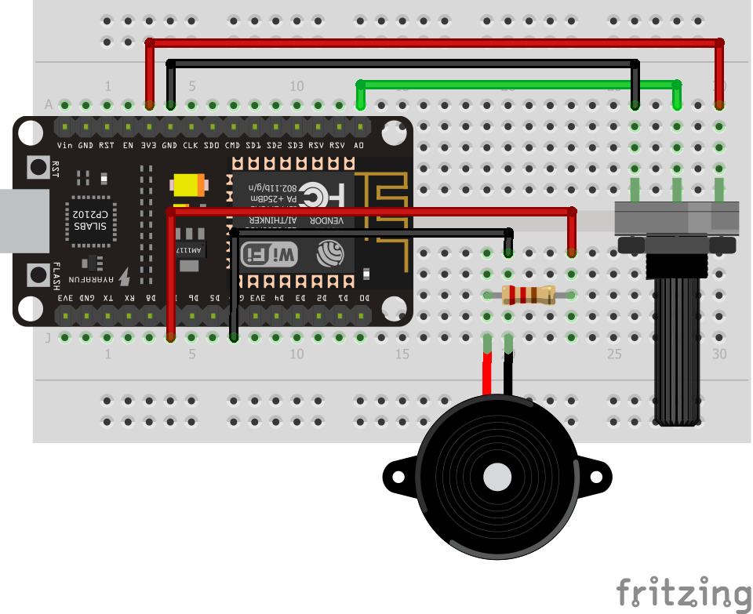
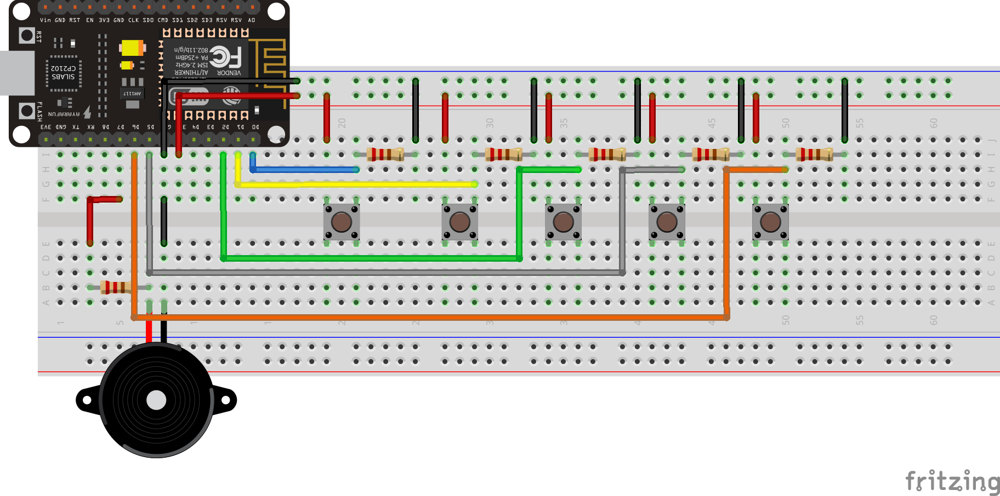

# 2. Buzzer

O projeto consiste em um buzzer ou Disco Piezoelétrico. O buzzer é um componente cujo funcionamento se expressa de forma sonora. Apesar disso, a qualidade do seu som apresenta limitações.
Ele pode ser usado em alarmes, teclados e em outros equipamentos que dependem de atuação sonora.  

Um disco piezo, feito de material cerâmico, funciona quando uma corrente elétrica passa pelo material fazendo com que ele se deforme e produza um som. O efeito piezoelétrico é um processo reversível, então quando se bate nele ou ele sofre algum tipo de pressão, a força no material provoca a geração de uma corrente elétrica. 


O circuito de um buzzer controlado por botões ou potenciômetro possibilita o aprendizado das seguintes competência trabalhadas no Módulo 1:

- [x] Leitura Analógica

## Conteúdo
- [Materiais Necessários](#materiais-necessários)
- [Montagem do Circuito](#montagem-do-circuito)
- [O Código do Circuito](#o-c&oacute;digo-do-circuito)

## Materiais Necessários
1. NodeMCU
2. Potenciômetro
3. 1 Buzzer
4. Protoboard
5. Jumpers

## Montagem do Circuito
O circuito deve ser montado como mostra a figura abaixo, representado na protoboard. 



O buzzer apresenta polaridade. O polo positivo pode ser identificado pela indicação com o sinal +. Além disso, o terminal positivo é maior que o negativo. O terminal positivo deve ser conectada a uma porta digital (não será necessário o recurso PWM, pois utilizaremos a função ```tone()``` para gerar os sinais sonoros) e o negativo deve ser conectada ao GND do NodeMCU (ressalta-se a importância do uso de um resistor de 100 Ω entre o terminal negativo e o GND).

O potenciômetro é um resistor de três terminais que pode ter sua resistência ajustada girando o eixo. Os terminais das extremidades devem ser conectados um na alimentação e outro no terra do circuito. Já o terminal do meio, que tem o valor da resistência variável, deve ser conectada a uma porta analógica.

## O código do Circuito

Para o buzzer controlado por potenciômetro use o código que está em [code](code/code1.ino) ou copie o código abaixo:
 
```C++
const int pot = A0;
const int som = D7;


void setup() {
  pinMode(som, OUTPUT);
  pinMode(pot,  INPUT);
}

void loop() {
  int frequencia = 500+8*analogRead(pot);
  tone(som,frequencia);
}
  
```

O uso do Buzzer não exige a importação de bibliotecas. O código acima começa com a declaração e associação das saídas e entradas utilizadas. 

O uso do buzzer depende da recepção de uma onda quadrada. O comando```tone()``` é responsável pela craição dessa onda. Dessa forma, tal função é usada para tocar uma nota musical, ela recebe três parâmetros: o pino digital onde o buzzer está conectado, a frequência da nota musical e o tempo de duração dessa nota, sendo este último opcional.

O código inicia com a declaração das constantes referentes ao potenciômetro (A0) e ao buzzer (D7). Posteriormente, as configurações iniciais do programa são definidas com o pino do buzzer sendo usado como saída e o pino do potenciômetro como entrada. 

A função ```loop()``` é formada pela variável que recebe a frequência desejada para ser executada pelo buzzer. Esse valor está baseado na leitura analógica feita no pino do potenciômetro. Além disso, a função contém ainda a o comando ```tone()``` que recebe como parâmetros o pino do buzzer e a frequência a ser tocada.

Com isso, o funcionamento esperado para o código consiste na frequência tocada pelo buzzer ser controlada pelo potenciômetro.

Caso tenha tido algum problema, abra uma *issue* clicando [aqui](https://github.com/PETEletricaUFBA/IoT/issues/new).


Para ouvir o som clique [aqui](https://raw.githubusercontent.com/PETEletricaUFBA/automacao-iot-nodemcu/master/M%C3%B3dulo%202/Atuadores/2.%20Buzzer%20controlado%20por%20bot%C3%B5es%20e%20pot%C3%AAnci%C3%AAmtro/assets/audiopot.mp3)

## Bônus

Desse modo, caso um botão seja pressionado, o buzzer vai emitir um som com determinada frequência, relativa às notas musicais. Após a emissão do som, há um tempo de espera e o som é interrompido. Ou seja, a produção sonora só continua enquanto o botão permanecer pressionado.

## Materiais Necessários
1. NodeMCU
2. 5 botões
3. 1 Buzzer
4. Protoboard
5. Jumpers
6. 1 Resistor de 100 Ω
7. 5 Resistores de 10 kΩ

## Montagem do Circuito
O circuito deve ser montado como mostra a figura abaixo, representado na protoboard. 



O buzzer deve ser conectado da mesma forma que no circuito anterior. Cada botão, conectado em circuito Pull-Down, só oferece 5V na entrada digital enquanto o botão for pressionado.

## O código do Circuito

Para o buzzer controlado por botôes use o código que está em [code](code/code2.ino) ou copie o código abaixo:
 
```C++
const int DO = D0;
const int RE = D1;
const int MI = D2;
const int FA = D5;
const int SOL= D6;

int estadoDo  = 0;
int estadoRe  = 0;
int estadoMi  = 0;
int estadoFa  = 0;
int estadoSol = 0;

const int som = D7;

int semiperiodo = 0;

void setup() {
  pinMode(som, OUTPUT);
  pinMode(DO,  INPUT);
  pinMode(RE,  INPUT);
  pinMode(MI,  INPUT);
  pinMode(FA,  INPUT);
  pinMode(SOL, INPUT);
}

void loop() {
  estadoDo = digitalRead(DO);
  estadoRe = digitalRead(RE);
  estadoMi = digitalRead(MI);
  estadoFa = digitalRead(FA);
  estadoSol= digitalRead(SOL);

  if(estadoDo && !estadoRe && !estadoMi && !estadoFa && !estadoSol) semiperiodo = 1894/3; // 264*3 Hz
  if(!estadoDo && estadoRe && !estadoMi && !estadoFa && !estadoSol) semiperiodo = 1684/3; // 297*3 Hz
  if(!estadoDo && !estadoRe && estadoMi && !estadoFa && !estadoSol) semiperiodo = 1515/3; // 330*3 Hz
  if(!estadoDo && !estadoRe && !estadoMi && estadoFa && !estadoSol) semiperiodo = 1420/3; // 352*3 Hz
  if(!estadoDo && !estadoRe && !estadoMi && !estadoFa && estadoSol) semiperiodo = 1263/3; // 396*3 Hz
  
  if(semiperiodo > 0) {
    digitalWrite(som, HIGH);
    delayMicroseconds(semiperiodo);   
    digitalWrite(som, LOW);
    delayMicroseconds(semiperiodo);
    semiperiodo = 0;
  }
}

```
O buzzer foi associado à constante 13 (D7), variável "som" no código, e os botões para cada nota, associados aos pinos: dó ao 16 (D0), ré ao 5 (D1), mi ao 4 (D2), fá ao 14 (D5), sol ao 12 (D6). 

Feito isso, partimos para o ```void setup``` onde é necessário declarar as entradas e saídas por meio do ```pinMode```. Posteriormente, inicia-se a função ```void loop```, ela consiste no uso de 5 desvios condicionais. A condição para que cada desvio seja executado é que o botão referente à um estado esteja pressionado e os outros não, ou seja, a variável de um botão está em nível lógico alto e a dos outros em nível lógico baixo. A execução do código é análoga à de um teclado, com cada botão associado a uma nota musical.

Cada ```delayMicroseconds``` representa um semiperíodo da onda quadrada. Dessa forma, os semiperíodos são referentes a um valor específico de frequência da onda sonora. Ressalta-se que a aplicação feita cria uma onda quadrada (com mesma frequência) baseando-se no tempo em que o botão permaneceu pressionado.

***Nota:*** Os valores atribuídos a cada semiperíodo baseiam-se nos cálculos referentes às notas musicais no terceiro harmônico.

Caso tenha tido algum problema, abra uma *issue* clicando [aqui](https://github.com/PETEletricaUFBA/IoT/issues/new).


Para ouvir o som clique [aqui](https://raw.githubusercontent.com/PETEletricaUFBA/automacao-iot-nodemcu/master/M%C3%B3dulo%202/Atuadores/2.%20Buzzer%20controlado%20por%20bot%C3%B5es%20e%20pot%C3%AAnci%C3%AAmtro/assets/audioteclado.mp3)

> Pense na utilização do Buzzer na sua casa ou em outras aplicações do seu cotidiano. 
