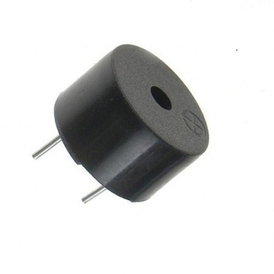

# 2. Buzzer controlado por botões

O projeto consiste em um buzzer ou Disco Piezoelétrico. O buzzer é um componente cujo funcionamento se expressa de forma sonora. Apesar disso, a qualidade do seu som apresenta limitações.
Ele pode ser usado em alarmes, teclados e em outros equipamentos que dependem de atuação sonora.  

Um disco piezo, feito de material cerâmico, funciona quando uma corrente elétrica passa pelo material fazendo com que ele se deforme e produza um som. O efeito piezoelétrico é um processo reversível, então quando se bate nele ou ele sofre algum tipo de pressão, a força no material provoca a geração de uma corrente elétrica. 



O circuito de um buzzer controlado por botões possibilita o aprendizado das seguintes competência trabalhadas no Módulo 1:

- [x] Leitura Digital

## Conteúdo
- [Materiais Necessários](#materiais-necessários)
- [Montagem do Circuito](#montagem-do-circuito)
- [O Código do Circuito](#o-c&oacute;digo-do-circuito)

## Materiais Necessários
1. NodeMCU
2. 8 botões
3. 1 Buzzer
4. Protoboard
5. Jumpers
6. 1 Resistor de 100 Ω
7. 8 Resistores de 10 kΩ

## Montagem do Circuito
O circuito deve ser montado como mostra a figura abaixo, representado na protoboard. 


O buzzer apresenta polaridade. O polo positivo pode ser identificado pela indicação com o sinal +. Além disso, o terminal positivo é maior que o negativo. O terminal positivo deve ser conectada a uma porta digital (não será necessário o recurso PWM, pois utilizaremos a função ```tone()``` para gerar os sinais sonoros) e o negativo deve ser conectada ao GND do NodeMCU (ressalta-se a importância do uso de um resistor de 100 Ω entre o terminal negativo e o GND).

## O código do Circuito

Use o código que está em [code](code/code1.ino) ou copie o código abaixo:
 
```C++
#define pino_buzzer 16
#define pino_do1 5
#define pino_re 4
#define pino_mi 0
#define pino_fa 2
#define pino_sol 14
#define pino_la 12
#define pino_si 13
#define pino_do2 15
#define tempo 1000

void setup()
{
  pinMode(pino_buzzer, OUTPUT);
  pinMode(pino_do1, INPUT);
  pinMode(pino_re, INPUT);
  pinMode(pino_mi, INPUT);
  pinMode(pino_fa, INPUT);
  pinMode(pino_sol, INPUT);
  pinMode(pino_la, INPUT);
  pinMode(pino_si, INPUT);
  pinMode(pino_do2, INPUT);
}

void loop()
{
  if (digitalRead(pino_do1)) {
    tone(pino_buzzer, 264, tempo);
  }
  if (digitalRead(pino_re)) {
    tone(pino_buzzer, 297, tempo);
    delay(tempo);
    noTone(pino_buzzer);
  }
  if (digitalRead(pino_mi)) {
    tone(pino_buzzer, 330, tempo);
    delay(tempo);
    noTone(pino_buzzer);
  }
  if (digitalRead(pino_fa)) {
   tone(pino_buzzer, 352, tempo);
    delay(tempo);
    noTone(pino_buzzer);
  }
  if (digitalRead(pino_sol)) {
   tone(pino_buzzer, 396, tempo);
    delay(tempo);
    noTone(pino_buzzer);
  }
  if (digitalRead(pino_la)) {
   tone(pino_buzzer, 440, tempo);
    delay(tempo);
    noTone(pino_buzzer);
  }
  if (digitalRead(pino_si)) {
   tone(pino_buzzer, 495, tempo);
    delay(tempo);
    noTone(pino_buzzer);
  }
  if (digitalRead(pino_do2)) {
   tone(pino_buzzer, 528, tempo);
    delay(tempo);
    noTone(pino_buzzer);
  }
}
  
```
O uso do Buzzer não exige a importação de bibliotecas. O código acima começa com a declaração e associação das saídas e entradas utilizadas. O buzzer foi associado à constante 16 (D0) e os botões para cada nota, associados aos pinos: dó unissóno ao 5 (D1), ré ao 4 (D2), mi ao 0 (D3), fá ao 2 (D4), sol ao 14 (D5), lá ao 12 (D6), si ao 13 (D7) e dó ao 15 (D8). Além disso, a constante tempo foi definida para uso posterior dos tempos de espera (em milissegundos).

Feito isso, partimos para o ```void setup``` onde é necessário declarar as entradas e saídas por meio do ```pinMode```. Posteriormente, inicia-se a função ```void loop```, ela consiste no uso de 8 desvios condicionais. A condição para que cada desvio seja executado é que o botão referente à estrutura condicional esteja pressionado, ou seja, sua respectiva variável está em nível lógico alto. A execução do código é análoga à de um teclado, com cada botão associado a uma nota musical.

Ressalta-se que o uso do buzzer depende de apenas dois comandos: ```tone()``` e ```noTone()```. O ```tone()``` é usado para tocar uma nota musical, ele recebe três parâmetros: o pino digital onde o buzzer está conectado, a frequência da nota musical e o tempo de duração dessa nota musical, sendo este último opcional. Enquanto isso, o comando ```noTone()``` é responsável por interromper a execução dessa nota musical e deve receber somente um parâmetro: o pino digital onde o Buzzer está conectado.

Desse modo, caso um botão seja pressionado, o buzzer vai emitir um som com determinada frequência, relativa às notas musicais. Após a emissão do som, há um tempo de espera e o som é interrompido. Ou seja, a produção sonora só continua enquanto o botão permanecer pressionado.

**Nota:** Após o uso do ```tone()```, recomenda-se o uso do comando ```delay()``` que dure o mesmo tempo que a duração da nota musical do ```tone()```. Caso contrário, o comando ```noTone()``` cessará a execução da nota rapidamente e ela não será percebida.

Ressalta-se que os valores, usados no código, para as frequências de cada nota musical foram extraídos da seguinte tabela:


Caso tenha tido algum problema, abra uma *issue* clicando [aqui](https://github.com/PETEletricaUFBA/IoT/issues/new).


> Pense na utilização do Buzzer na sua casa ou em outras aplicações do seu cotidiano. 
