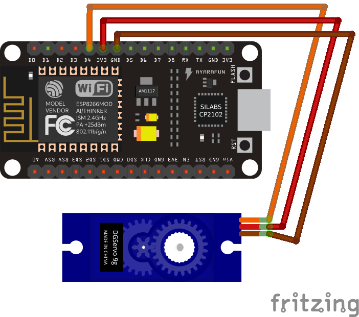

# 3. Servo motor controlado por um potenciômetro

Por meio desse módulo aprenderemos o que são e como funcionam alguns importantes e usuais atuadores. Nesse projeto falaremos um pouco mais sobre servomotores e o controle desse famoso atuador.

 Através desse circuito criamos uma aplicação capaz de controlar a rotação do motor de forma simples e mecânica. Esse projeto, inclusive, pode ser utilizado para controlar braços robóticos ou mesmo, abrir a cortina de casa com um simples giro de um potenciômetro!
 
 <p align="center">
  
</p>
 

Nesse momento você pode estar se perguntando o que é ou como funciona um microservo. O microservo é um atuador extremamente requisitado em projetos de eletrônica, mecatrônica, automação e robótica. Enquanto em projetos de robótica faz a função de mover as extremidades do robô, em projetos de automobilismo e aeromobilismo, respectivamente, podem controlar as rodas dianteiras ou os flaps da asa dos aviões. Dessa forma, os servos são motores que apresentam um controle de posição angular, podendo variar de -90° até 90°, ou seja 180° de grau de liberdade!

O servomotor que utilizaremos para essa prática, como vimos na figura acima, é o Servo Motor SG90 9g, um servo pequeno, mas com um torque satisfatório para a maioria dos projetos de robótica educacional

> Neste projeto você irá aprender como realizar o controle de um servomotor através de dois circuitos distintos!


## Conteúdo
- [Materiais Necessários](#materiais-necessários)
- [Montagem do Circuito](#montagem-do-circuito)
- [O Código do Circuito](#o-c&oacute;digo-do-circuito)

## Materiais Necessários
1. NodeMCU
2. Servo Motor SG90 9g
3. Potenciômetro
4. Protoboard
5. Jumpers

## Montagem do Circuito

Primeiramente vamos conhecer os terminais do microservo:


Como visto na primeira imagem do projeto, o microservo apresenta três terminais diferentes
1.Fio Laranja - Sinal PWM
2.Fio Vermelho - +VCC
3.Fio Marrom - GND

Portanto, enquanto o fio vermelho e o fio marrom serão conectados a +3v3 e GND, respectivamente, no NODEMCU, o fio laranja será conectado a um terminal digital, capaz de fornecer um sinal PWM e controlar a rotação do motor.

<p align="center">
  
</p>

Para a aplicação que utiliza o potênciometro,
como visto em práticas anteriores, os terminais da extremidade se conectam com o +3v3 e GND, respectivamente, enquanto que o terminal do meio é conectado em um pino analógico do NODEMCU (A0)


<p align="center">
  
</p>


## O código do Circuito

>Use o código que está em [code1](code1/code1.ino) ou copie o código abaixo:
 
```C++

#include <Servo.h>
Servo servo;

void setup() {
  servo.attach(2); //D4
  servo.write(0);
  delay(2000);
}

void loop() {
  for(int i=0; i<=90; i++) {
    servo.write(i);
    delay(20);
  }
  for(int i=90; i>=0; i--) {
    servo.write(i);
    delay(10);
  }
}
}
  
```

O circuito começa através da adição de uma biblioteca chamada ```"Servo.h"```. Ao usar essa biblioteca trataremos cada servomotor como um objeto, dessa forma precisamos declará-lo no início do código, por isso escrever ```"Servo servo"```. Feito isso, vamos para o void setup. No void setup utilizamos duas funções da biblioteca ```servo.h```: ```.attach``` que é utilizado para indicar qual entrada do NODEMCU será usada e o .write que indica para qual ângulo ele deve se deslocar. 

 É importante dizer que o write não indica quantos graus o servomotor deve se deslocar e sim para qual grau ele deve ir. Isto é, se você usa ```write(0)``` e depois write(90) ele irá se mover uma vez e depois ficará parado. É importante frisar ainda que, existe uma angulação máxima a qual o servomotor está construído para ir,  caso, via programação um write seja dado com uma angulação superior ao limite suportado, o atuador irá parar no grau máximo.
 
 Portanto, no void setup, indicamos que o servomotor começa com 0º e através do loop criado com os dois for's, já no void loop, fazemos o ângulo variar de 0°
 a 90° e depois de 90° a 0°

 
O resultado obtido pode ser visto a seguir:


Para a segunda aplicação temos:
>Use o código que está em [code1](code2/code2.ino) ou copie o código abaixo:
```C++
#include <Servo.h>
Servo servo;
const int pot = A0;

void setup() {
  pinMode(A0, INPUT);
  servo.attach(2); //D4
  servo.write(0);
  delay(2000);
}

void loop() {
  servo.write(map(analogRead(A0),0,1023,0,180));
}
```
Análogo a programação do circuito anterior. O código para esse projeto começa com a inclusão de uma biblioteca chamada ```Servo.h```. Ao usar essa biblioteca trataremos cada servomotor como um objeto, precisamos, por conseguinte, declará-lo no início do código, por isso escrever ```Servo servo```. Feito isso, vamos para o ```void setup```. No ```void setup``` utilizamos duas funções da biblioteca ```servo.h```: ```.attach``` que é utilizado para indicar qual entrada do NODEMCU será usada e o ```.write``` que indica para qual ângulo ele deve se deslocar. 

Como adicionamos um potenciômetro, utilizamos o ```pinMode(A0, INPUT)```, atestando que o potenciômetro é uma entrada e está conecatado a entrada ```A0```.

No ```void loop``` utilizamos a, já conhecida, função map, que realiza uma conversão entre um valor analógico do potênciometro e o ângulo no servo (valores entre 0 e 180). Dessa forma, ao variar entre valores de (0 a 1023), variamos também o grau de abertura do servomotor.

O resultado pode ser visto no gif a seguir:

 

> Pense na quantidade de aplicações que podemos fazer com esta aplicação, como por exemplo, simular o movimento dos braços e pernas de um robô!
