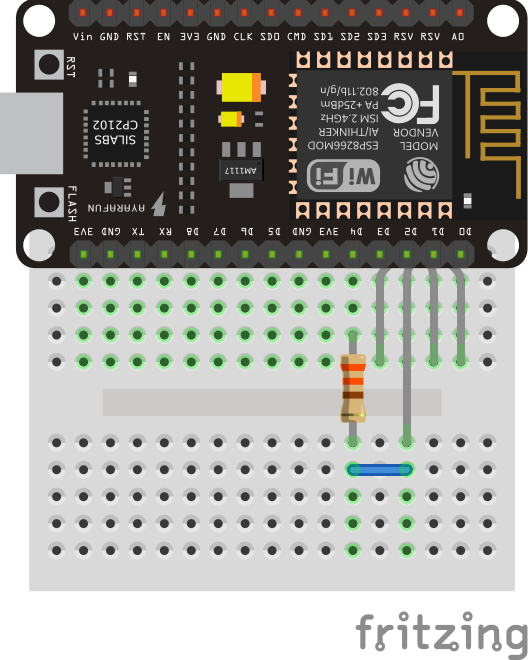
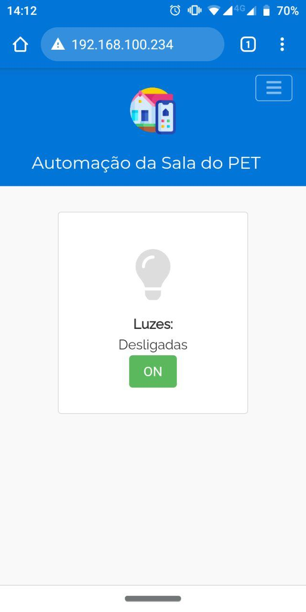

# 1. Webserver com página estática

*Web server* é o local onde se armazena arquivos/páginas de sites, processa e os entrega para o cliente web, um navegador em computadores e celulares. O protocolo que se utiliza para a comunicação entre cliente e servidor é o HTTP, do inglês Hypertext Transfer Protocol (Protocolo de Transferência de Hipertexto).

Integrar seu projeto físico a um *web sever* é essencial caso queira acessá-lo a distância com fins de controlar ou supervisionar o processo envolvido.

> Nesse projeto você irá aprender a criar um web server de página estática na rede interna e integrá-lo ao seu projeto físico no ESP 8266.

## Conteúdo
- [Materiais Necessários](#materiais-necessários)
- [Montagem do Circuito](#montagem-do-circuito)
- [O Código do Circuito](#o-c&oacute;digo-do-circuito)

## Materiais Necessários
1. NodeMCU
2. 1 LED RGB cátodo comum
3. 1 Resistor de 220Ω a 1KΩ
4. Protoboard
5. Jumpers

## Montagem do Circuito
O circuito deve ser montado como mostra a figura abaixo, representado na protoboard.

<p align="center">
  
</p>

Para esta aplicação, utilizamos um LED RGB, que possui 4 terminais ao invés de 2. Neste tipo de LED, o terminal maior é o cátodo comum (terminal negativo) e os outros são terminais positivos das LEDs internas que são: vermelho, verde e azul. Assim é possível associar as cores com finalidade de se obter qualquer cor dentro do espectro de luz visível. O cátodo é conectado a um resistor de 330Ω limitador de corrente e, em seguida, ir direto para o pino digital D4 do NodeMCU. 

**OBS: É importante saber que o uso de *web servers* não se restringe a esse projeto. Após a compreensão do que foi feito no post, experimente criar uma outra aplicação física e integrá-la a um web server.**

## O código do Circuito

Use o código que está em [code](code/code.ino) ou copiei o código abaixo:

```c++
#include <ESP8266WiFi.h>

const char* ssid = "NOME DA SUA REDE WIFI";
const char* password = "SENHA DO SEU WIFI";

IPAddress ip(192,168,100,234); 
IPAddress gateway(192,168,100,0); 
IPAddress subnet(255,255,255,0);

WiFiServer server(80);

const int redPin    = D2;
const int greenPin  = D1;
const int bluePin   = D0;

const int led = D4;
boolean stateLed = 0;

void ledColor(char color) {
  switch (color) {
    case 'c':
      digitalWrite(redPin, 0);
      digitalWrite(greenPin, 0);
      digitalWrite(bluePin, 0);
      break;
    case 'r':
      digitalWrite(redPin, 255);
      digitalWrite(greenPin, 0);
      digitalWrite(bluePin, 0);
      break;
    case 'g':
      digitalWrite(redPin, 0);
      digitalWrite(greenPin, 255);
      digitalWrite(bluePin, 0);
      break;
    case 'b':
     digitalWrite(redPin, 0);
     digitalWrite(greenPin, 0);
     digitalWrite(bluePin, 255);
     break;
  }
}

void setup() {
  pinMode(redPin,OUTPUT);
  pinMode(greenPin,OUTPUT);
  pinMode(bluePin,OUTPUT);
  
  pinMode(led,OUTPUT);

  ledColor('b');
  
  Serial.begin(115200);
  delay(10);
  
  Serial.println("");
  Serial.println("");
  Serial.print("Conectando a ");
  Serial.print(ssid);

  WiFi.begin(ssid, password);
  WiFi.config(ip, gateway, subnet);
  
  byte i=0;
  
  while (WiFi.status() != WL_CONNECTED) {
    if (i++%2==0) ledColor('b'); else ledColor('c');
    delay(500);
    Serial.print(".");
  }
  
  Serial.println("");
  Serial.print("Conectado a rede sem fio ");
  Serial.println(ssid);
  server.begin();
  Serial.println("Servidor iniciado");

  Serial.print("IP para se conectar ao NodeMCU: ");
  Serial.print("http://");
  Serial.println(WiFi.localIP());
  ledColor('g');
}

String split(String r) {
  if (r == "GET /favicon.ico HTTP/1.1") return r;
  String b = "";
  for(int i=5; i<10; i++) b+=r[i];
  return b;
}

void loop() {
  WiFiClient client = server.available();
  if (!client) {
    return;
  }
  
  Serial.println("Novo cliente se conectou!");
  /*
  while(!client.available()){
    delay(1);
  }
  */
  
  String request = client.readStringUntil('\r');
  
  if (split(request) == "ligar") { 
    digitalWrite(led, 0);
    stateLed = 1;
  }
  if (split(request) == "desli") { 
    digitalWrite(led, 1);
    stateLed = 0;
  }
  
  Serial.println(request);
  client.flush();

  client.println("HTTP/1.1 200 OK"); // ESCREVE PARA O CLIENTE A VERSÃO DO HTTP
  client.println("Content-Type: text/html"); 
  client.println("");
  // <html> <head> </head>
  client.println("<!DOCTYPE html><html> <head> <meta charset='utf-8'> <meta http-equiv='X-UA-Compatible' content='IE=edge'> <meta name='viewport' content='width=device-width, initial-scale=1, shrink-to-fit=no'> <meta name='mobile-web-app-capable' content='yes'> <meta name='apple-mobile-web-app-status-bar-style' content='black-translucent'/> <meta name='theme-color' content='#0275d8'> <link rel='icon' type='image/x-icon' href='https://raw.githubusercontent.com/PETEletricaUFBA/automacao-iot-nodemcu/master/assets/automation.png'/> <title>Automação da Sala</title> <script src='https://code.jquery.com/jquery-2.1.4.min.js'></script> <script src='https://cdnjs.cloudflare.com/ajax/libs/tether/1.4.0/js/tether.min.js'></script> <link rel='stylesheet' href='https://cdnjs.cloudflare.com/ajax/libs/tether/1.4.0/css/tether.min.css'> <script> $(document).ready(function (){       var sideslider = $('[data-toggle=collapse-side]');    var sel = sideslider.attr('data-target');    var sel2 = sideslider.attr('data-target-2');    sideslider.click(function(event){    $(sel).toggleClass('in');    $(sel2).toggleClass('out');    });});$(document).ready(function() {    const $valueSpan = $('.valueSpan');    const $value = $('#slider11');    $valueSpan.html($value.val());    $value.on('input change', () => {        $valueSpan.html($value.val());    });  }); </script> <link rel='stylesheet' href='https://maxcdn.bootstrapcdn.com/bootstrap/4.0.0-alpha.6/css/bootstrap.min.css' integrity='sha384-rwoIResjU2yc3z8GV/NPeZWAv56rSmLldC3R/AZzGRnGxQQKnKkoFVhFQhNUwEyJ' crossorigin='anonymous'> <script src='https://maxcdn.bootstrapcdn.com/bootstrap/4.0.0-alpha.6/js/bootstrap.min.js' integrity='sha384-vBWWzlZJ8ea9aCX4pEW3rVHjgjt7zpkNpZk+02D9phzyeVkE+jo0ieGizqPLForn' crossorigin='anonymous'></script> <style>*{    font-family: 'Raleway', sans-serif;}   pre {    tab-size: 8;}body{    background-color: #f9f9f9;}.container-fluid{    padding: 20px;}.navbar-brand{    font-family: 'Montserrat', sans-serif;}.card{    margin-bottom: 20px;    text-align: center;}.card, .card-text{    width: 100vw;    color: #333;}@media (min-width: 768px) {     .card, .card-text{        width: 40vw;    }}.card-text{    width:100%;    word-wrap: break-word;}.navbar-inverse .navbar-toggler{    border-color: rgba(255,255,255,0.5);}.fa-bars{    color: rgba(255,255,255,0.5);}.card-title{    font-size: 60px;}.card-title img{    height: 60px;}.fa-positivo{    color: limegreen;}.fa-negativo{    color:red;}.fa-invalido{    color:#FFDA44;}.fa-bomba{    color: dodgerblue;}.logo {    width: 75px;    height: 75px;    display: block;    margin: 5px auto;    padding: 10px;}.slidecontainer {    width: 100%;  }    .slider {    -webkit-appearance: none;    width: 100%;    height: 10px;    border-radius: 5px;    background: #d3d3d3;    outline: none;    opacity: 0.8;    -webkit-transition: .2s;    transition: opacity .2s;  }    .slider:hover {    opacity: 1;  }    .slider::-webkit-slider-thumb {    -webkit-appearance: none;    appearance: none;    width: 25px;    height: 25px;    border-radius: 50%;    background: rgb(30, 85, 187);    cursor: pointer;  }    .slider::-moz-range-thumb {    width: 25px;    height: 25px;    border-radius: 50%;    background: rgb(30, 85, 187);    cursor: pointer;  }  .center {    display: block;    margin: 10px auto;    max-width: 70%;  }</style> <link href='https://fonts.googleapis.com/css?family=Montserrat|Raleway' rel='stylesheet'> <script src='https://kit.fontawesome.com/a552ae84ad.js' crossorigin='anonymous'></script> </head>");
  // <body> <nav> </nav>
  client.println("<body> <nav class='navbar navbar-toggleable-md navbar-inverse bg-primary'> <button class='navbar-toggler navbar-toggler-right' type='button' data-toggle='collapse' data-target='#navbarSupportedContent' aria-controls='navbarSupportedContent' aria-expanded='false' aria-label='Toggle Navigation'> <i class='fa fa-bars' aria-hidden='true'></i> </button>  <h1 class='navbar-brand mb-0 text-center'>Automação da Sala do PET</h1> <div class='collapse navbar-collapse' id='navbarSupportedContent'> <ul class='navbar-nav mr-auto'> <li class='nav-item active'> <a class='nav-link' href='index.html'>Home</a> <span class='sr-only'>(current)</span> </li> <li class='nav-item'> <a class='nav-link' href='sobre.html'>Sobre</a> </li> </ul> </div> </nav>");
  // <container> <row>
  client.println("<div class='container-fluid'> <div class='row'> ");
  
  // ------ LED --------
  // <card>
  client.println("<div class='col-sm'> <div class='card center'> <div class='card-block center'>");
  if(stateLed==0) {
    client.println("<span class='card-title'><i class='fa fa-lightbulb' aria-hidden='true' style='color:#dddddd;'></i></span>");
    client.println("<br><span><b>Luzes:</b> Desligadas</span>");
    client.println("<form action='/ligar' method='get'>");//Cria um botao GET para o link /LED
    client.println("<input class='btn btn-success' type='submit' value='ON' id='frm1_submit'/></form>");
  } else {
    client.println("<span class='card-title'><i class='fa fa-lightbulb' aria-hidden='true' style='color:rgb(255, 238, 0);'></i></span>");
    client.println("<br><span><b>Luzes:</b> Ligadas</span>");
    client.println("<form action='/desligar' method='get'>");//Cria um botao GET para o link /LED
    client.println("<input class='btn btn-danger' type='submit' value='OFF' id='frm1_submit'/></form>");
  }
  // </card>
  client.println("</div> </div> </div>");
  // ------------------

  // </container> </row>
  client.println("</div> </div>");

  // </body> </html>
  client.println("</body> </html>");
  
  delay(1); 
  Serial.println("Cliente desconectado"); 
  Serial.println(""); 
}
```
A primeira coisa você deve fazer é mudar este trecho de código, inserindo o nome da sua rede WiFi e a sua senha (fique tranquilo(a), essa informação não será divulgada na Internet).

```c++
const char* ssid = "NOME DA SUA REDE";
const char* password = "SENHA DA SUA REDE";
```

E por último, você deve editar essas linhas. Os parâmetros da segunda e da terceira linha se referem ao gateway padrão e máscara de sub-rede que podem ser encontradas seguindo este [tutorial](https://www.sony.com.br/electronics/support/laptop-pc-sve-series/sve15111ebs/articles/00022321). Os três primeiros parâmetros do _ip_ você deve mantê-los iguais aos do _gateway_, já no último parâmetro você coloca um número entre 100 e 255.

```c++
IPAddress ip(192,168,100,234); 
IPAddress gateway(192,168,100,0); 
IPAddress subnet(255,255,255,0);
```

A função _ledColor()_ recebe um _char_ como parâmetro e liga o RGB de acordo com esse parâmetro.

O seguinte trecho de código é quando uma requisição é efetuada, isto é, o usuário "pede" para que o LED seja ligado ou desligado através do web server. **O LED utilizado como exemplo é um cátodo comum, por isso a lógica foi feita dessa forma, caso se constate que o seu LED é um ânodo comum, substitua no parâmetro da função digitalWrite 0  por 1 e 1 por 0, respectivamente.**

```c++
if (split(request) == "ligar") { 
    digitalWrite(led, 0);
    stateLed = 1;
}
if (split(request) == "desli") { 
    digitalWrite(led, 1);
    stateLed = 0;
}
```

O seguinte trecho utiliza a função _client.println()_ para exibir um conteúdo na página em HTML, isto é interpretado pelos navegadores e exibido em forma de uma página Web, para aprender mais sobre HTML, clique [aqui](https://www.w3schools.com/html/default.asp).

Nota-se que existe uma estrutura condicional que muda o conteúdo da página dependendo do estado do LED. Este trecho pode ser facilmente duplicado caso você queira adicionar outro LED. Não esqueça de mudar os nomes das variáveis!

```c++
  // ------ LED --------
  // <card>
  client.println("<div class='col-sm'> <div class='card center'> <div class='card-block center'>");
  if(stateLed==0) {
    client.println("<span class='card-title'><i class='fa fa-lightbulb' aria-hidden='true' style='color:#dddddd;'></i></span>");
    client.println("<br><span><b>Luzes:</b> Desligadas</span>");
    client.println("<form action='/ligar' method='get'>");//Cria um botao GET para o link /LED
    client.println("<input class='btn btn-success' type='submit' value='ON' id='frm1_submit'/></form>");
  } else {
    client.println("<span class='card-title'><i class='fa fa-lightbulb' aria-hidden='true' style='color:rgb(255, 238, 0);'></i></span>");
    client.println("<br><span><b>Luzes:</b> Ligadas</span>");
    client.println("<form action='/desligar' method='get'>");//Cria um botao GET para o link /LED
    client.println("<input class='btn btn-danger' type='submit' value='OFF' id='frm1_submit'/></form>");
  }
  // </card>
  client.println("</div> </div> </div>");
  // ------------------
```

As demais funções utilizadas neste código, são funções padrão das bibliotecas e por motivos de simplificação, não serão explicadas. 

**OBS:**
1. Utilize o monitor serial para te auxiliar na resolução de problemas. A partir do monitor serial conseguimos identificar em que momento acontece e a causa do erro de compilação.

2. Nesse projeto optamos por utilizar um LED RGB, no entanto, caso você não possua um, o projeto pode ser facilmente adaptado para um LED comum de dois terminais.

3. Caso opte por utilizar um LED RGB, atente-se para a possibilidade do seu LED RGB ser ânodo comum ou cátodo comum.

Gif de funcionamento   | Imagem da página num smartphone
--------- | ------
 | 

Caso tenha tido algum problema abra uma _issue_ clicando [aqui](https://github.com/PETEletricaUFBA/IoT/issues/new)


> É importante saber que o uso de *web servers* não se restringe a esse projeto com LEDs em específico. Após a compreensão do que foi feito no post, experimente criar uma outra aplicação física e integrá-la a um web server. É possível, por exemplo, controlar todas as lâmpadas de sua casa ou um eletrodoméstico, ativar ou desativar alarme de segurança via navegador do seu celular ou computador.